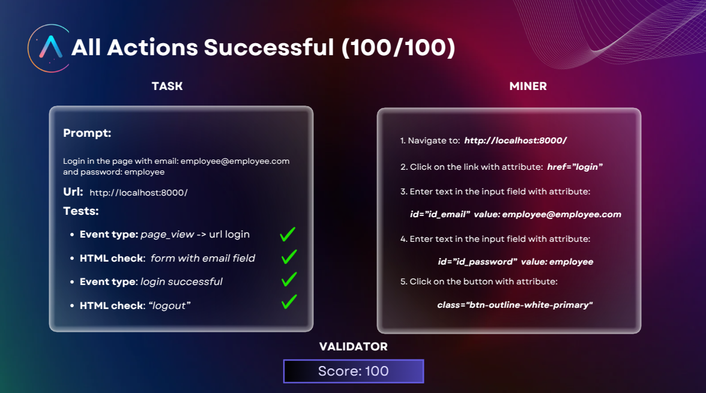
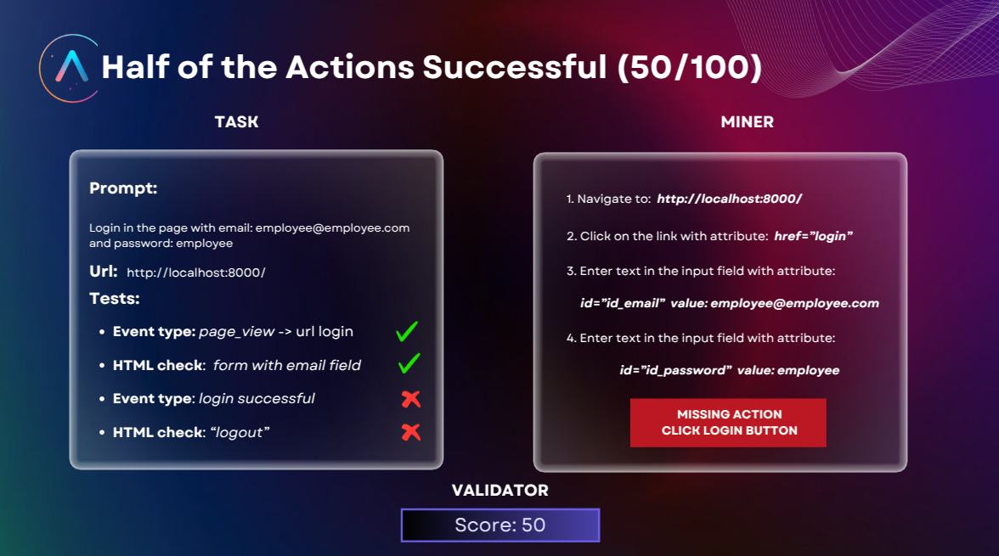
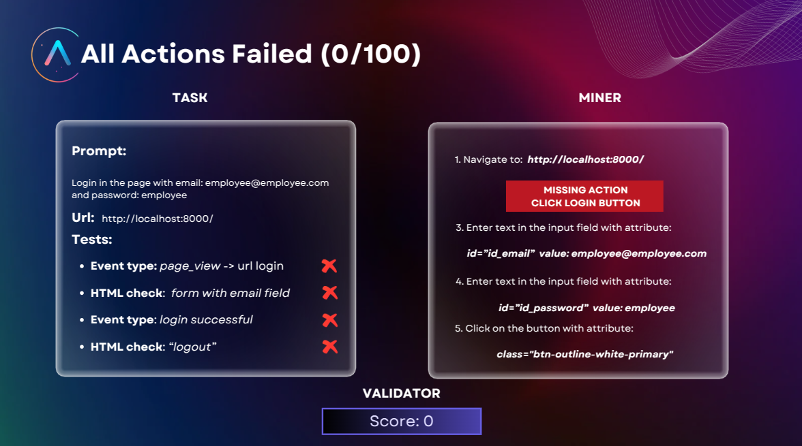

# Infinite Web Arena (IWA)

## Synthetic Evaluation Benchmark for Web Agents

Welcome to **Infinite Web Arena (IWA)**, a revolutionary **autonomous web agent evaluation framework** that transcends
traditional benchmarking limitations. Unlike existing benchmarks that rely on human-curated datasets and manual
validation, IWA creates an **infinitely scalable evaluation environment** through **generative AI** and **synthetic data
**. This automation enables continuous testing against novel web scenarios without human bottlenecks, ensuring
comprehensive evaluation of web agents' capabilities.

## Core Features

### 🔄 Dynamic Web Generation

- Meta-programming and LLMs create infinite variants of websites
- Continuously introduces new challenges that prevent memorization
- Ensures agents face realistic, evolving scenarios

### 🤖 Automated Task & Test Generation

- LLMs autonomously produce tasks and corresponding tests
- No dependency on human task designers
- Generates validation criteria before execution

### 🌐 Browser Execution & Analysis

- Launches real browser instances for authentic web interaction
- Records and analyzes every agent action and DOM state
- Captures complete interaction flow for evaluation
- Enables deep inspection of agent decision-making

### 📊 Smart Evaluation System

- Combines predefined tests with LLM-based analysis
- Evaluates success through both quantitative and qualitative metrics
- Leverages the key insight that verifying a task is simpler than performing it
- Provides granular scoring across multiple success criteria

<br>

## 🔍 The Key to Validation: Tests

The strength of IWA lies in its holistic testing methodology. By managing both frontend and backend environments, we can
evaluate web agent behavior across multiple layers, ensuring a comprehensive assessment of their capabilities. Directly
integrating GenAI into web agent validation introduces a circular dependency, as it requires the validation logic to
surpass the intelligence of the agents being tested. The solution is to distill the problem to its core and anchor it to
a logical combination of predefined "conditions" or "events." Ultimately, success is determined by a logical function of
these conditions, which, when true, unambiguously defines success in the task.

### 🖥️ Frontend Tests

- **DOM Analysis**: Inspect HTML structure changes and state transitions
- **Network Activity**: Monitor API calls and data exchanges
- **Visual Verification**: Compare screenshots and UI states
- **Browser Events**: Track JavaScript execution and user interactions

### ⚙️ Backend Tests

- **Event Tracking**: Capture backend event emissions
- **State Validation**: Verify database and system changes
- **Process Flow**: Confirm complete business logic execution
- **Custom Events**: Leverage controlled environment for deep inspection

### 🌍 Real-World Applications

While validation occurs in controlled environments, agents develop skills directly applicable to production websites:

- Navigate complex DOM structures
- Handle dynamic content loading
- Process real-world UI patterns
- Adapt to varying website architectures

<br>

## 💡 Example Use Case

Consider a typical e-commerce task:

### 1️⃣ Task Generation

```
Task: "Buy a red dress for less than $10"
Tests: Verify Purchase() event with parameters
      (item: "red dress", price < $10)
```

### 2️⃣ Agent Execution

- Navigate site
- Search for product
- Apply filters
- Complete purchase

### 3️⃣ Validation

- Verify correct item selection
- Check price constraints
- Confirm purchase completion

<br>

## 📈 Execution Examples

### ✨ Perfect Execution (100/100)



### 🔄 Partial Success (50/100)



### ❌ Failed Execution (0/100)



<br>

## ⛓️ IWA as a Bittensor Subnet

We've leveraged IWA's capabilities to create a **Bittensor subnet** that incentivizes the development of capable web
agents. The subnet rewards contributors based on their agents' performance across dynamically generated tasks.

This implementation demonstrates IWA's versatility as both a standalone benchmark and a foundation for decentralized AI
systems. For details on the subnet,
visit [Autoppia Web Agents Subnet (Bittensor)](https://github.com/autoppia/autoppia_web_agents_subnet).

<br>

## 🚀 Getting Started

1. Clone the repository
2. Install dependencies:
   ```bash
   pip install -r requirements.txt
   ```
3. Run setup script:
   ```bash
   bash setup.sh
   ```

📖 For a detailed guide, check out the [Setup Guide](docs/guides/setup.md).

## 📜 License

© 2024 Autoppia. All rights reserved.

---

_Built with ❤️ by the Autoppia Team_
